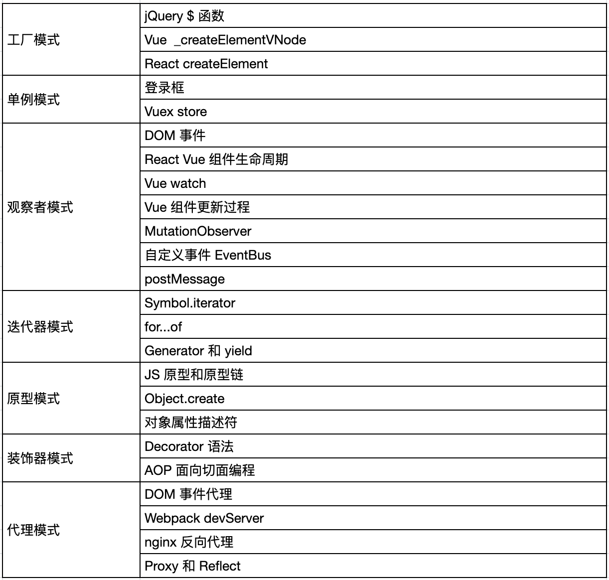

# 导学

大家好，我是慕课网双越老师，欢迎跟我学习《快速掌握前端必备的 7 个设计模式》课程。

## 高级工程师必备技能

有句话叫“需求指导设计，设计指导开发” —— 这是大厂研发的流程。
PS：中小型公司也许不这么规范，但你自己要奔着规范的流程去。不要让这个公司把你给限制住，公司是公司，你是你。

你学会了 HTML CSS JS Vue React 等，这些是为了做开发
你学会了设计模式，就能让你做设计（技术方案设计，不是 UI 设计）—— 只有技术大牛才能指导别人做设计，一般人设计不了

所以，设计模式是高级工程师的必备技能，你可以问问你身边的比较厉害的工程师，他们肯定都精通常用的设计模式。

## 只学 7 种

传统设计模式有 23 种，但有些在前端不常用，学了也会很快忘记。我作为过来人，自己也有这样的经历。
所以，本课程只学习 7 种，学精、学透，让你学完就忘不掉。

（哪 7 种模式？请课程目录的思维导图）

## 结合使用场景讲解

如何学完忘不掉呢？—— 把设计对应的使用场景，你用起来了，或者知道怎么用了，也就忘不了了。
没有场景的设计模式，你是不可能记住的。

结合场景，你可能会恍然大悟：哦，原来我一直用这些技术，但我之前却不知道对应设计模式的名字。
我们不能光有实践经验，也要适当的进行理论总结。要知道我们所做的事情是对应到哪个知识点，这样才能慢慢的完善自己的知识体系。

## JS 高阶语法和 API

JS 从简单的脚本语言，到现在慢慢发展状态，其中有很多语法和 API 都是直接从现有的设计模式参考过来的，并不是 JS 自己创新的。
所以，学习设计模式的过程，也是学习这些高阶语法和 API 的过程。例如：

例如：Decorator, Iterator, Generator/yield, Proxy/Reflect,  MutationObserver, 对象属性描述符

高级程序员需要精通设计模式，也需要精通这些高阶语法和 API ，这都是相辅相成的。
或者说：如果没有设计模式的加持，你只能学会这些 API 的表象，而不能彻底理解它的设计用意。

## 零基础也能学会

能看到这里，说明你已经非常认同设计模式的价值和本课程的讲解方式了。
你还剩最后一个问题：我刚入门前端，刚学会 JS ，能学会设计模式吗？我在网上查资料，感觉设计模式很难，很抽象。

如果你能有这种疑问，那说明你思考问题很全面，很适合做软件工程师。
我现在告诉你答案：你说的没错，设计模式就是很抽象的，不太容易入门，不太容易讲清楚，但我用我的方式可以给你讲清楚 —— 这也是我们课程的核心价值
熟悉我的学员都知道，我的讲课风格一直是：深入浅出，把晦涩的知识一层一层讲清楚，讲明白。

如下图：一开始讲设计原则和面向对象，这是比较抽象的，你可能看不懂，但没关系，你继续往下看，我会在后面的课程“反哺”前面的内容，通过一步一步的实践把之前抽象的知识给“安全着陆”，让你理解。

## 学习前提

当然，刚才说的“零基础”不是什么都不会，注意以下学习前提：

- 熟悉 HTML CSS JS
- 了解 Vue 或 React
- 了解 webpack

## 总结

祝早日精通设计模式，早日突破技术瓶颈
