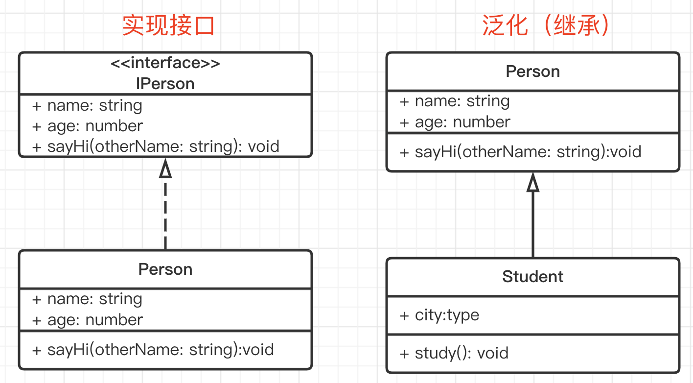

# UML 类图

## 介绍

UML - Unified Modeling Language - 统一建模语言
软件工程（不仅是编程）中的任何设计都可以用它来表述，包含：

- **类图**
- 用例图
- 对象图
- 顺序图
- 协作图
- 状态图
- 活动图
- 组件图
- 配置图

## UML 类图的作用

- 需求指导设计，设计指导开发
- 开发之前，写技术方案设计文档，并评审
- UML 类图就是一个重要的工具和表达方式。如果你和同事都熟悉 UML 类图，那会减少很多沟通成本，不用看代码就可以知道你的代码结构，核心属性和方法

## 工具

- https://www.processon.com/
- MS Visio

## 单个类

三个区域
- 类名
- 属性
- 方法

权限描述
- `+` public
- `#` protected
- `-` private

## 类图的几种关系

- 实现 - 实现接口
- 泛化 - 继承
- 关联 - A 是 B 的一个属性
    - 聚合 - 整体包含部分，部分可以脱离整体单独存在
    - 组合 - 整体包含部分，部分不可脱离整体
    - 依赖 - 不是属性，函数参数、返回值

【注意】聚合、组合、依赖，**都属于关联关系**，更加细化了。日常工作中没必要区分那么细致，都当做关联关系即可。

### 实现接口

注意：TS 的 interface 和 Java 的不一样，TS 有属性，而 Java 的没有属性。而 UML 类图是依据 Java 语法而画的（没有属性区域），课程里也合并到一个区域了。

### 泛化 - 继承父类

### 关联

分类
- 单项关联 - 最常见
- 双向关联
- 自关联

### 聚合

整体包含部分，部分可以脱离整体单独存在

### 组合

整体包含部分，部分**不可**脱离整体

### 依赖

不是属性，函数参数、返回值

## 总结

再次体会 UML 类图的作用

- 单个类
- 类之间的关系
- 关联关系的细分，不必过于较真

