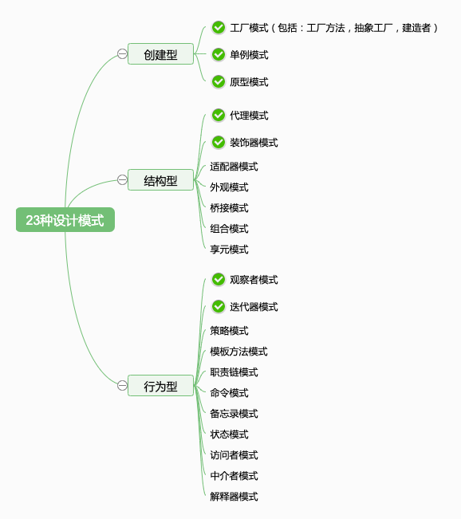

# 23 种设计模式

## 从设计到模式

“设计”和“模式”两个词应该分开读，先有设计，后有模式。
- 设计：设计原则，设计思想
- 模式：前辈总结出来的固定的套路

为何需要设计？—— 因为软件规模变大，甚至是一个系统集群，需要先设计，后开发，否则就乱掉

为何需要模式？—— 可套用前人经验，降低设计和沟通的成本

## 23 种设计模式

1995 年，四位前辈出版了一本书《设计模式：可复用面向对象软件的基础》，里面总结了常用的 23 种设计模式，被后人一直沿用至今。

- 创建型模式
    - **工厂模式**（包括：工厂方法模式，抽象工厂模式，建造者模式）
    - **单例模式**
    - **原型模式**
- 结构型模式
    - 适配器模式
    - **装饰器模式**
    - **代理模式**
    - 外观模式
    - 桥接模式
    - 组合模式
    - 享元模式
- 行为型模式
    - 策略模式
    - 模板方法模式
    - **观察者模式**
    - **迭代器模式**
    - 职责连模式
    - 命令模式
    - 备忘录模式
    - 状态模式
    - 访问者模式
    - 中介者模式
    - 解释器模式

## 前端常用的设计模式

> 这就是课程的价值，帮你节省时间，直击重点，不盲目

1995 年还没有前端，所有当时的一些设计模式，并不完全适用于现在。而且，前后端也有区别。

所以，前端最常用的设计模式，就以下几个：
- 工厂模式
- 单例模式
- 原型模式
- 装饰器模式
- 代理模式
- 观察者模式
- 迭代器模式

要结合实际应用，把它们学精、学透彻，要明白 JS 是如何体现这些设计模式的。
让你学完了就忘不了（不常用的，学完就忘）

## 总结

- 从设计到模式
- 23 种设计模式
- 前端常用设计模式
