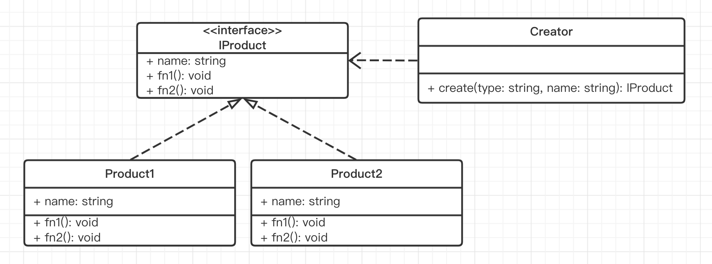
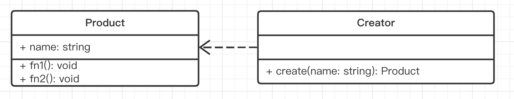

# 演示

## 标准的工厂模式



```ts
interface IProduct {
    name: string
    fn1: () => void
    fn2: () => void
}

class Product1 implements IProduct { 
    name: string
    constructor(name: string) {
        this.name = name
    }
    fn1() { 
        alert('product1 fn1')
    }
    fn2() { 
        alert('product1 fn2')
    }
}

class Product2 implements IProduct { 
    name: string
    constructor(name: string) {
        this.name = name
    }
    fn1() { 
        alert('product2 fn1')
    }
    fn2() { 
        alert('product2 fn2')
    }
}

class Creator { 
    create(type: string, name: string): IProduct {
        if (type === 'p1') {
            return new Product1(name)
        }
        if (type === 'p2') {
            return new Product2(name)
        }
        throw new Error('Invalid type')
    }
}
```

## 简单的工厂模式



```ts
class Product { 
    name: string
    constructor(name: string) {
        this.name = name
    }
    fn1() { 
        alert('product fn1')
    }
    fn2() { 
        alert('product fn2')
    }
}


class Creator { 
    create(name: string): Product {
        return new Product(name)
    }
}
```

## 是否符合设计原则？

5 大设计原则中，最重要的就是：**开放封闭原则**，对扩展开放，对修改封闭

- 工厂和类分离，解耦
- 可以扩展多个类
- 工厂的创建逻辑也可以自由扩展
