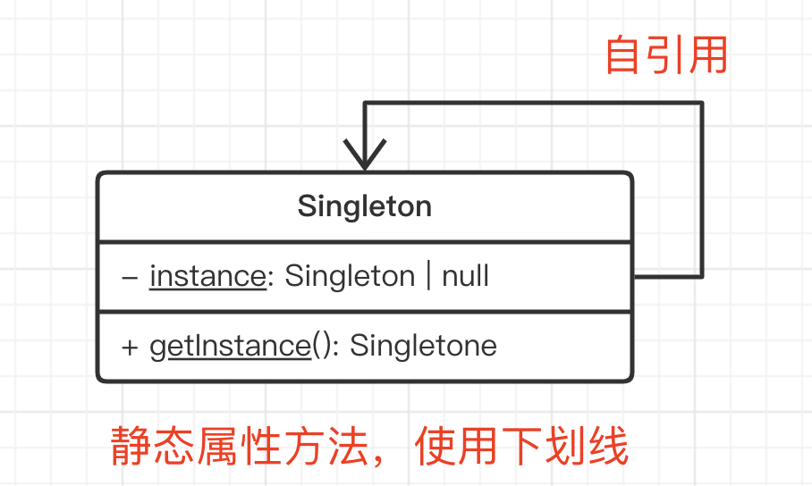

# 演示



## 使用 TS 特性

- `static` 静态属性和方法 —— **详细介绍一下，对比“静态xx”和“实例xx”**
- `private` 外部无法直接初始化

```js
class Singleton {
    // private - 外部无法初始化
    private constructor() { }

    // static 属性
    private static instance: Singleton | null

    // static 方法
    static getInstance(): Singleton {
        // 这里也可以写 `this.instance` ，注意和实例方法中 this 的区别！！！
        if (Singleton.instance == null) {
            Singleton.instance = new Singleton()
        }
        return Singleton.instance
    }
}

// const s1 = new Singleton() // 直接初始化会报错
// Singleton.instance // 直接访问 instance 也会报错

// 创建实例
const s1 = Singleton.getInstance()
const s2 = Singleton.getInstance()

console.log(s1 === s2) // true
```

## 不使用 TS 特性

最常见的方式，使用闭包

```js
function genGetInstance() {
    let instance // 闭包

    class Singleton {}

    return () => {
        if (instance == null) {
            instance = new Singleton
        }
        return instance
    }
}

const getInstance = genGetInstance()

const s1 = getInstance()
const s2 = getInstance()
```

结合模块化语法，会更好一些

```js
let instance // 闭包

class Singleton {}

// 外部只能 import 这个函数
export default () => {
    if (instance == null) {
        instance = new Singleton
    }
    return instance
}
```

## 是否符合设计原则？

5 大设计原则中，最重要的就是：**开放封闭原则**，对扩展开放，对修改封闭

- 内部封装 getInstance ，内聚，解耦

## 注意事项

JS 是单线程语言，如果是 Java 等多线程语言，单例模式需要加**线程锁**。