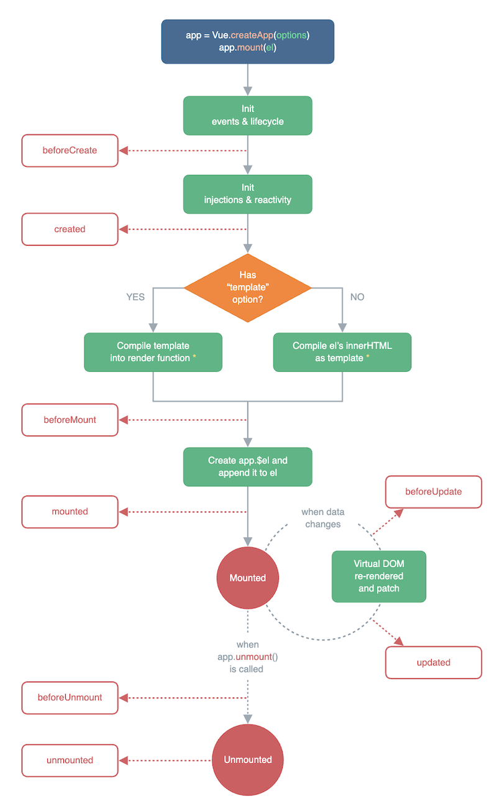

# 介绍

观察者模式是前端最常用的一个设计模式，也是 UI 编程最重要的思想。

## 示例

例如你在星巴克点了咖啡，此时你并不需要在吧台坐等，你只需要回到位子上玩手机，等咖啡好了服务员会叫你。不光叫你，其他人的咖啡好了，服务员也会叫他们来取。

还有，DOM 事件就是最常用的观察者模式

```html
<button id="btn1">btn</button>

<script>
    const $btn1 = $('#btn1')
    $btn1.click(function () {
        console.log(1)
    })
    $btn1.click(function () {
        console.log(2)
    })
    $btn1.click(function () {
        console.log(3)
    })
</script>
```

还有，Vue React 的生命周期，也是观察者模式


