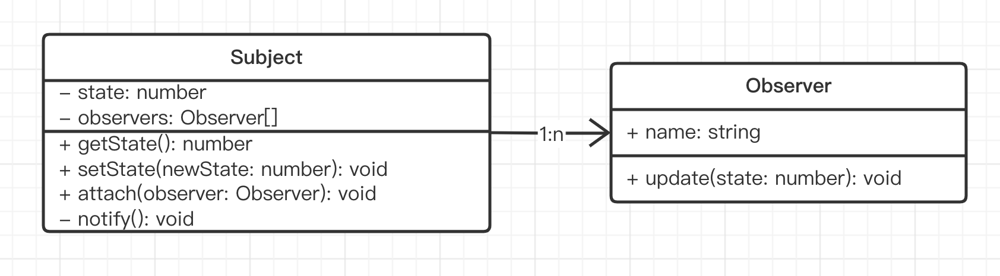

# 演示

Subject 和 Observer 是**一对多**的关系



```ts
// 主题
class Subject {
    private state: number = 0
    private observers: Observer[] = []

    getState(): number {
        return this.state
    }

    setState(newState: number) {
        this.state = newState
        this.notify()
    }

    // 添加观察者
    attach(observer: Observer) {
        this.observers.push(observer)
    }

    // 通知所有观察者
    private notify() {
        for (const observer of this.observers) {
            observer.update(this.state)
        }
    }
}

// 观察者
class Observer {
    name: string
    constructor(name: string) {
        this.name = name
    }
    update(state: number) {
        console.log(`${this.name} update, state is ${state}`)
    }
}

const sub = new Subject()
const observer1 = new Observer('A')
sub.attach(observer1)
const observer2 = new Observer('B')
sub.attach(observer2)

sub.setState(1) // 更新状态，触发观察者 update
```

## 是否符合设计原则？

5 大设计原则中，最重要的就是：**开放封闭原则**，对扩展开放，对修改封闭

- Observer 和 Target 分离，解耦
- Observer 可自由扩展
- Target 可自由扩展
