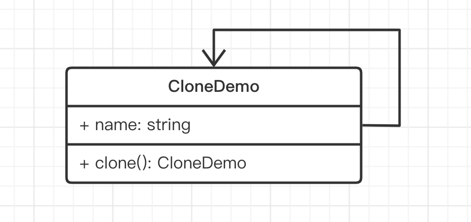

# 介绍

定义：用一个已经创建的实例作为原型，通过复制该原型对象来创建一个和原型相同或相似的新对象

传统的原型模式就是克隆，但这在 JS 中并不常用。



```ts
class CloneDemo {
    name: string = 'clone demo'

    clone(): CloneDemo {
        return new CloneDemo()
    }
}
```

JS 中并不常用原型模式，但 JS 对象本身就是基于原型的，原型和原型链是非常重要的概念。
