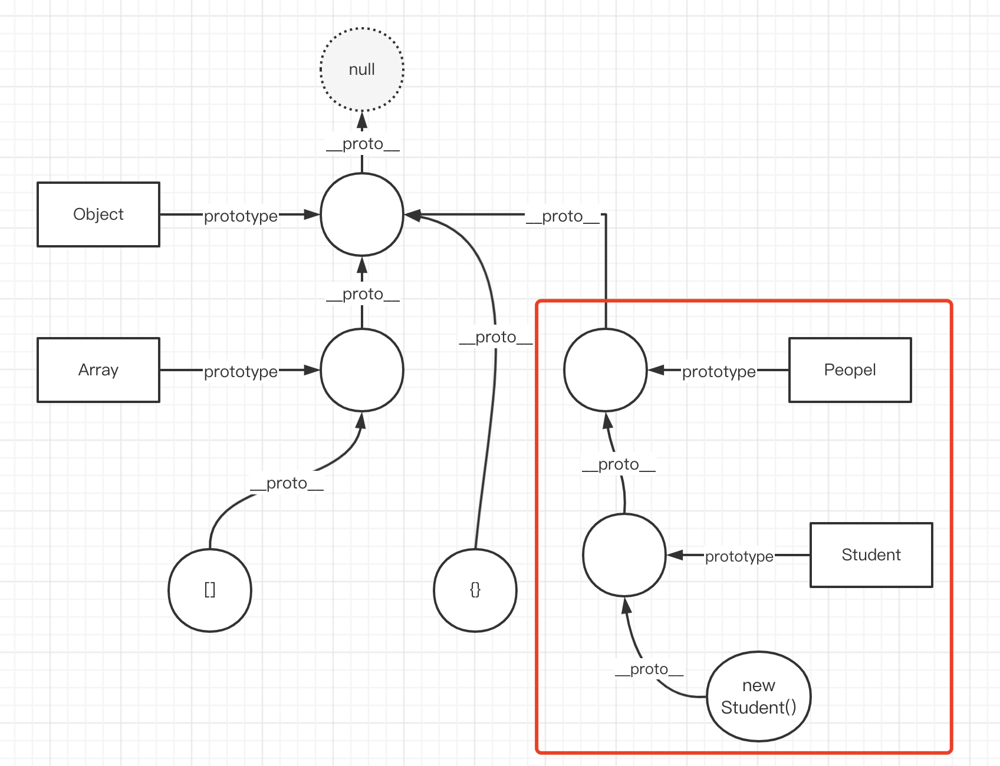

# 原型和原型链

（图文小节）

## 函数和显示原型 `prototype`

JS 中所有函数都有一个 `prototype` 属性。例如
- `Object.prototype`
- `Array.prototype`

自定义的函数也有

```ts
// 1. 注意第一参数 this ；2. 暂且用 any 表示，实际会用 class 
function Foo(this: any, name: string, age: number) {
    this.name = name
    this.age = age
}

Foo.prototype.getName = function () {
    return this.name
}

Foo.prototype.sayHi = function () {
    alert('hi')
}
```

## 对象和隐式原型 `__proto__`

### 引用类型

JS 所有的引用类型对象都是通过函数创建的，都有 `__proto__` ，**指向其构造函数的 `prototype`**


```js
const obj = {} // 相当于 new Object()
obj.__proto__ === Object.prototype

const arr = [] // 相当于 new Array()
arr.__proto__ === Array.prototype

const f1 = new Foo('张三', 20)
f1.__proto__ === Foo.prototype
const f2 = new Foo('李四', 21)
f2.__proto__ === Foo.prototype
```

访问对象属性或 API 时，首先查找自身属性，然后查找它的 `__proto__`

```js
f1.name
f1.getName()
```

### 值类型的 API

值类型没有 `__proto__` ，但它依然可访问 API 。因为 JS 会先将它包装为引用类型，然后触发 API

```js
const str = 'abc'
str.slice(0, 1) // 调用 String.prototype.string
```

## 原型链

上文讲过，一个对象的 `__proto__` 指向它构造函数的 `prototype` ，**而 `prototype` 本身也是一个对象，也会指向它构造函数的 `prototype`** ，于是就形成了原型链。


## class 是函数的语法糖

class 和函数一样，也是基于原型实现的。

```ts
class Foo {
    name: string
    age: number
    constructor(name: string, age: number) {
        this.name = name
        this.age = age
    }
    getName() {
        return this.name
    }
    sayHi() {
        alert('hi')
    }
}

Foo.prototype

const f1 = new Foo('张三', 20)
f1.__proto__ = Foo.prototype
```

## 继承

```ts
class People {
    name: string
    age: number
    constructor(name: string, age: number) {
        this.name = name
        this.age = age
    }
    eat() {
        alert(`${this.name} eat something`)
    }
    speak() {
        alert(`My name is ${this.name}, age ${this.age}`)
    }
}
class Student extends People {
    school: string
    constructor(name: string, age: number, school: string) {
        super(name, age)
        this.school = school
    }
    study() {
        alert(`${this.name} study`)
    }
}

const s1 = new Student('aa', 20, 'xx')
s1.study()
s1.eat()
```



## 总结

- 函数或 class 都有 prototype
- 对象都有 `__proto__` 指向构造函数 prototype
- 原型链（图）

PS：原型和原型链的范围非常广泛，遇到新问题可以在课程里提问。
