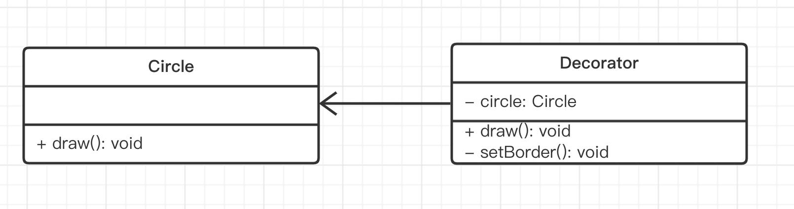

# 演示



```ts
class Circle {
    draw() {
        console.log('画一个圆')
    }
}

class Decorator {
    private circle: Circle
    constructor(circle: Circle) {
        this.circle = circle
    }
    draw() {
        this.circle.draw()
        this.setBorder()
    }
    private setBorder() {
        console.log('设置边框颜色')
    }
}

const circle = new Circle()
circle.draw()

const decorator = new Decorator(circle)
decorator.draw()
```

## 是否符合设计原则？

5 大设计原则中，最重要的就是：**开放封闭原则**，对扩展开放，对修改封闭

- 装饰器和目标分离，解耦
- 装饰器可自行扩展
- 目标也可自行扩展
