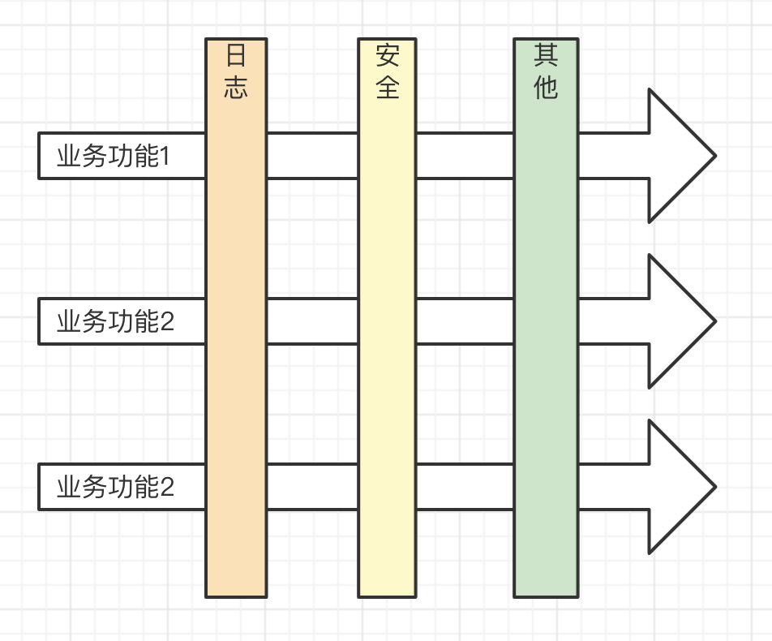

# AOP

## 介绍

AOP - Aspect Oriented Programming 面向切面编程

简单来说：业务和系统基础功能分离，用 Decorator 很合适



PS：AOP 和 OOP 并不冲突

## 实现 log

```ts
function log(target: any, key: string, descriptor: PropertyDescriptor) {
    const oldValue = descriptor.value // fn1 函数

    // 重新定义 fn1 函数
    descriptor.value = function () {
        console.log(`记录日志...`)
        return oldValue.apply(this, arguments)
    }
}

class Foo {
    @log // 不影响业务功能的代码，只是加了一个 log 的“切面”
    fn1() {
        console.log('业务功能1')
    }
}

const f = new Foo()
f.fn1()
```
