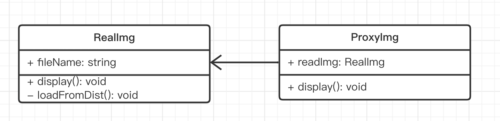

# 演示



```ts
class RealImg {
    fileName: string
    constructor(fileName: string) {
        this.fileName = fileName
        this.loadFromDist()
    }
    display() {
        console.log('display...', this.fileName)
    }
    private loadFromDist() {
        console.log('loading...', this.fileName)
    }
}

class ProxyImg {
    readImg: RealImg
    constructor(fileName: string) {
        this.readImg = new RealImg(fileName)
    }
    display() {
        this.readImg.display()
    }
}

const proxImg = new ProxyImg('xxx.png') // 使用代理
proxImg.display()
```

## 是否符合设计原则？

5 大设计原则中，最重要的就是：**开放封闭原则**，对扩展开放，对修改封闭

- 代理和目标分离，解耦
- 代理可自行扩展逻辑
- 目标也可自行扩展逻辑

