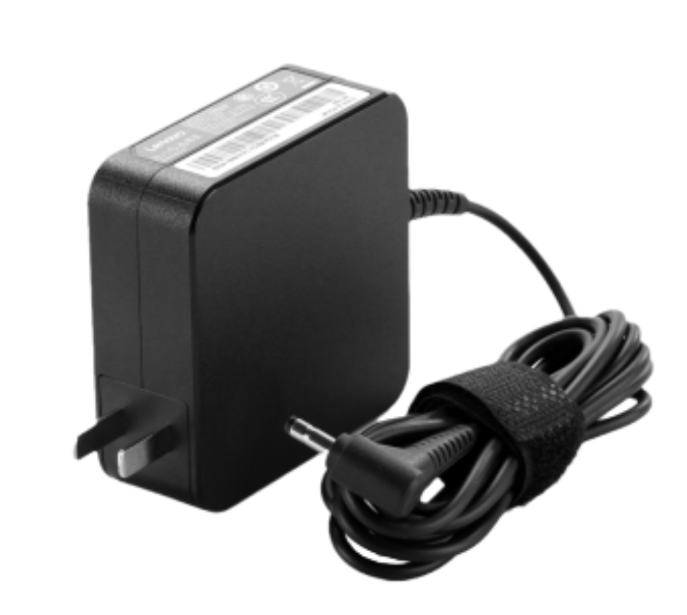

# 适配器模式

## 介绍

我们需要一个对象的 API 提供能力，但它的格式不一定完全适合我们的格式要求。这就要转换一下。

例如电脑、手机的电源适配器



## 演示

```ts
// 电源插口
class Source {
    supply() {
        return '220V 电源'
    }
}

// 适配器
class Adapter {
    source = new Source()
    adaptedSupply() {
        const sourceRes = this.source.supply()
        return `${sourceRes} --> 12V 电源`
    }
}

// 手机使用
const adapter = new Adapter()
const res = adapter.adaptedSupply()
console.log(res)
```

## 场景

Vue computed

```js
// Vue 组件配置
{
    data() {
        return {
            userList: [
                { id: 1, name: '张三' },
                { id: 2, name: '李四' },
                { id: 3, name: '王五' },
            ]
        }
    },
    computed: {
        userNameList() {
            this.userList.map(user => user.name) // ['张三', '李四', ... ]
        }
    }
}
```
