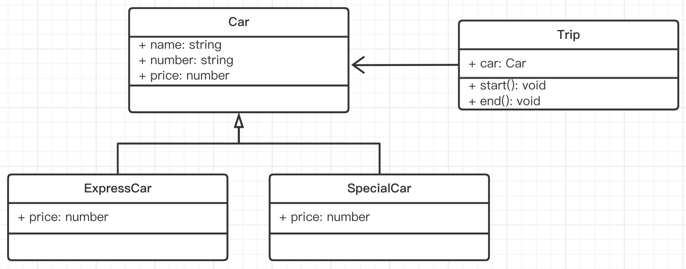

# 面试题 - 打车

## 题目

背景
- 打车时，你可以打快车和专车
- 无论什么车，都有车牌号和车辆名称
- 打不同的车价格不同，快车每公里 1 元，专车每公里 2 元
- 打车时，你要启动行程并显示车辆信息
- 结束行程，显示价格（假定行驶了 5 公里）

题目
- 画出 UML 类图
- 用 TS 语法写出该示例

## 分析

抽象数据模型
- 车，抽象为一个 class
- 快车，专车是派生类，有一个父类或接口 （快车、专车，有相同，有不同）
- 行程，抽象为一个 class ，且和车有关系

属性和方法
- 车：车牌号，名称（在父类或接口），价格（在派生类）
- 行程：开始，结束
- 行程：关联的车辆

## UML 类图



## 代码演示

```ts
class Car {
    name: string
    number: string
    price = 0
    constructor(name: string, number: string) {
        this.name = name
        this.number = number
    }
}

class ExpressCar extends Car {
    price = 1
    constructor(name: string, number: string) {
        super(name, number)
    }
}

class SpecialCar extends Car {
    price = 2
    constructor(name: string, number: string) {
        super(name, number)
    }
}

class Trip {
    car: Car
    constructor(car: Car) {
        this.car = car
    }
    start() {
        console.log(`行程开始，名称: ${this.car.name}, 车牌号: ${this.car.number}`)
    }
    end() {
        console.log('行程结束，价格: ' + (this.car.price * 5))
    }
}

// const car = new ExpressCar('桑塔纳', 'A111222')
const car = new SpecialCar('迈腾', 'B333444')
const trip = new Trip(car)
trip.start()
trip.end()
```

## 总结

- 分析：数据模型，属性和方法，关系
- UML 类图
- 代码演示
