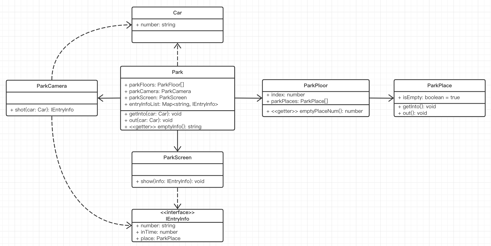

# 面试题 - 停车场

## 题目

描述：
- 某停车场，分 3 层，每层 100 车位
- 每个车位可以监控车辆的进入和离开
- 车辆进入前，显示每层的空余车位数量
- 车辆进入时，摄像头可识别车牌号和时间
- 车辆出来时，出口显示器显示车牌号和停车时长

题目：
- 画出 UML 类图

（代码量较多，正式面试时不用一行一行写，画图即可）

## 分析

数据模型
- 车
- 停车场，层，车位
- 摄像头，显示屏

梳理流程
- 进入之前：显示当前空余车位
- 进入：计停车数量，计算开始时间
- 离开：计算结束时间，减停车数量

## UML 类图



## 代码演示

HTML 代码

```html
<div>
    <button id="btn-car1-into">car1 进入</button>
    <button id="btn-car1-out">car1 离开</button>
    <br>
    <button id="btn-car2-into">car2 进入</button>
    <button id="btn-car2-out">car2 离开</button>
    <br>
    <button id="btn-car3-into">car3 进入</button>
    <button id="btn-car3-out">car3 离开</button>
</div>
```

TS 代码

```ts
// 车
class Car {
    number: string
    constructor(number: string) {
        this.number = number
    }
}

// 停车信息
interface IEntryInfo {
    number: string
    inTime: number
    place?: ParkPlace
}

// 入口摄像头
class ParkCamera {
    // 拍照
    shot(car: Car): IEntryInfo {
        return {
            number: car.number,
            inTime: Date.now()
        }
    }
}

// 出口显示器
class ParkScreen {
    show(info: IEntryInfo) {
        const { inTime, number } = info
        const duration = Date.now() - inTime
        console.log(`车牌号：${number} ，停留时间：${duration}`)
    }
}

// 车位
class ParkPlace {
    isEmpty = true
    getInto() {
        this.isEmpty = false
    }
    out() {
        this.isEmpty = true
    }
}

// 层
class ParkFloor {
    index: number
    parkPlaces: ParkPlace[]
    constructor(index: number, places: ParkPlace[]) {
        this.index = index
        this.parkPlaces = places
    }
    get emptyPlaceNum(): number {
        let num = 0
        for (const place of this.parkPlaces) {
            if (place.isEmpty) num++
        }
        return num
    }
}

// 停车场
class Park {
    parkFloors: ParkFloor[]
    parkCamera = new ParkCamera()
    parkScreen = new ParkScreen()
    entryInfoList: Map<string, IEntryInfo> = new Map() // key 是 car.number

    constructor(floors: ParkFloor[]) {
        this.parkFloors = floors
    }

    getInto(car: Car) {
        // 获取摄像头的信息：车牌号，时间
        const entryInfo = this.parkCamera.shot(car)
        // 某个车位
        const i = Math.round((Math.random() * 100) % 100)
        const place = this.parkFloors[0].parkPlaces[i] // 停在第一层的某个车位（想要第二层，第三层，也可以用随机数获取）
        // 进入车位
        place.getInto()
        // 记录停车信息
        entryInfo.place = place
        this.entryInfoList.set(car.number, entryInfo)
    }

    out(car: Car) {
        // 获取停车信息
        const entryInfo = this.entryInfoList.get(car.number)
        if (entryInfo == null) return
        const { place } = entryInfo
        if (place == null) return

        // 从车位离开
        place.out()

        // 出口显示屏，显示
        this.parkScreen.show(entryInfo)

        // 删除停车信息
        this.entryInfoList.delete(car.number)
    }

    // 当前停车场的空余车位
    get emptyInfo(): string {
        return this.parkFloors.map(floor => {
            return `${floor.index} 层还有 ${floor.emptyPlaceNum} 个车位`
        }).join('\n')
    }
}

// ---------- 初始化停车场 ----------
const floors: ParkFloor[] = []
// 3 层
for (let i = 0; i < 3; i++) {
    const places: ParkPlace[] = []
    // 每层 100 个车位
    for (let j = 0; j < 100; j++) {
        places[j] = new ParkPlace()
    }
    floors[i] = new ParkFloor(i + 1, places)
}
const park = new Park(floors)

// ---------- 模拟车辆进入、离开 ----------
const car1 = new Car('A1')
const car2 = new Car('A2')
const car3 = new Car('A3')

document.getElementById('btn-car1-into')?.addEventListener('click', () => {
    console.log('第一辆车即将进入')
    console.log(park.emptyInfo)
    park.getInto(car1)
})
document.getElementById('btn-car1-out')?.addEventListener('click', () => {
    console.log('第一辆车离开')
    park.out(car1)
})
document.getElementById('btn-car2-into')?.addEventListener('click', () => {
    console.log('第二辆车即将进入')
    console.log(park.emptyInfo)
    park.getInto(car2)
})
document.getElementById('btn-car2-out')?.addEventListener('click', () => {
    console.log('第二辆车离开')
    park.out(car2)
})
document.getElementById('btn-car3-into')?.addEventListener('click', () => {
    console.log('第三辆车即将进入')
    console.log(park.emptyInfo)
    park.getInto(car3)
})
document.getElementById('btn-car3-out')?.addEventListener('click', () => {
    console.log('第三辆车离开')
    park.out(car3)
})
```

## 总结

- 题目信息
- 分析
- UML 类图
- 代码演示
